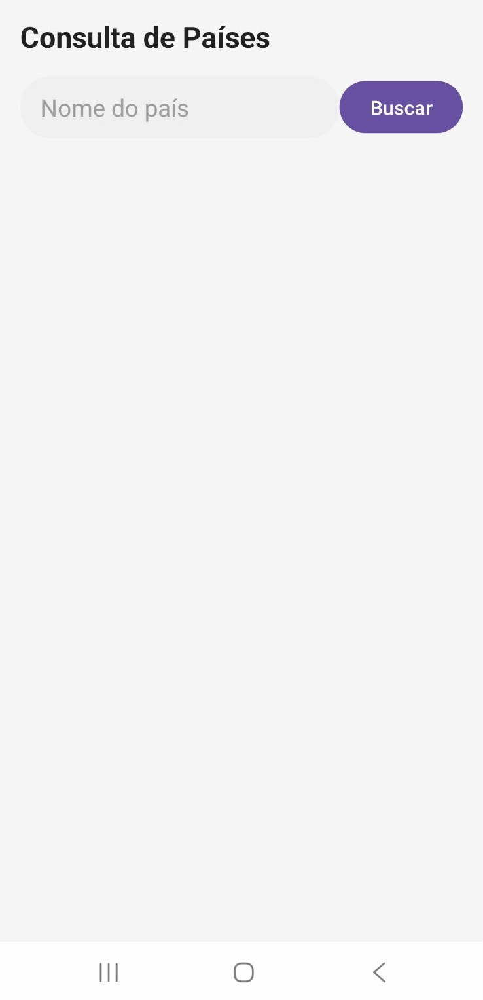
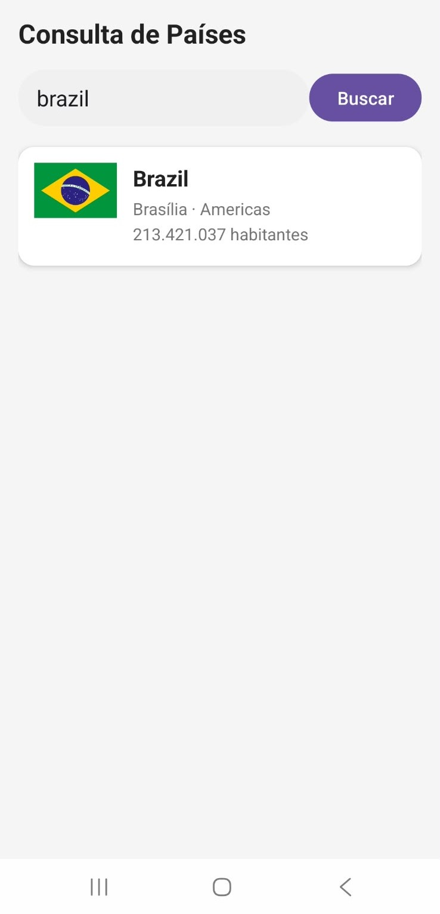
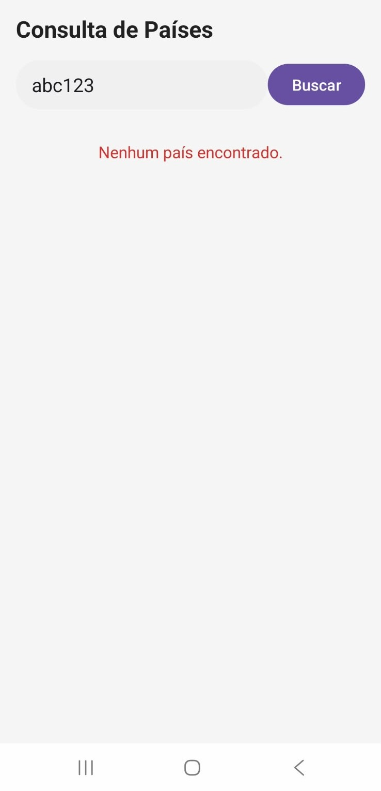

# Consulta de Países

Aplicativo Android em **Kotlin**, com **ConstraintLayout** e **RecyclerView**, que consome a API pública **REST Countries** para buscar informações de países dinamicamente.

## Funcionalidades

- Campo de busca dinâmica por nome do país.
- Lista de resultados organizada, exibindo bandeira, capital, região e população.
- Estado de carregamento (indicador de progresso) durante a requisição.
- Tratamento de erro (falha de conexão) e de "nenhum resultado encontrado".

## API utilizada

[REST Countries](https://restcountries.com) — versão v5.

- Endpoint: `GET https://api.restcountries.com/countries/v5/name?q={nome}`
- Requer chave de API gratuita, enviada no header `Authorization: Bearer {chave}`.
- Retorna dados como nome, capital, região, população e bandeira do(s) país(es) encontrado(s).

## Capturas de tela

| Tela inicial | Resultado da busca | Nenhum resultado / erro |
|---|---|---|
|  |  |  |

## Tecnologias utilizadas

Kotlin, ConstraintLayout, RecyclerView, CardView, Retrofit + Gson (requisições HTTP e parse de JSON), OkHttp (interceptor de autenticação), Coil (carregamento de imagens).

## Como compilar e executar

1. Clone o repositório:
   ```bash
   git clone https://github.com/gustavognm/consulta-paises-android.git
   ```
2. Crie uma conta gratuita em [restcountries.com](https://restcountries.com) e gere uma chave de API.
3. Na raiz do projeto, abra (ou crie) o arquivo `local.properties` e adicione a linha:
   ```
   RESTCOUNTRIES_API_KEY=sua_chave_aqui
   ```
4. Abra o projeto no Android Studio e aguarde a sincronização do Gradle.
5. Conecte um dispositivo Android (com internet) ou inicie um emulador, e clique em **Run ▶**.

## Autor

Gustavo Nunes Melo
